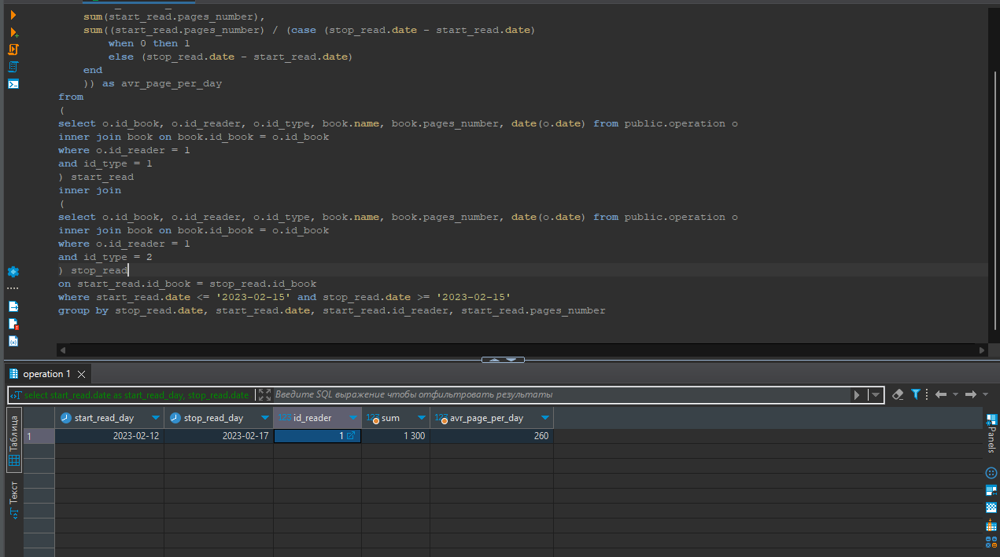

Инициализация базы данных "Библиотека"

Запуск: `docker-compose up`

Запросы к БД:  
1) Определить, сколько книг прочитал каждый читатель в текущем году. Вывести рейтинг читателей по убыванию:  
```sql
SELECT operation.id_reader, reader.full_name, count(operation.id_reader) AS rate FROM operation 
INNER JOIN reader ON operation.id_reader = reader.id_reader
WHERE operation.id_type = 2 
AND operation.date > '2023-01-01' 
AND operation.id_book IN (SELECT id_book FROM operation 
		WHERE id_type = 1 
		AND operation.date > '2023-01-01') 
GROUP BY operation.id_reader, reader.full_name
ORDER BY rate DESC
```  
2) Определить, сколько книг у читателей на руках на текущую дату:  
```sql
SELECT count(id_book) AS not_returned_books FROM (
	SELECT id_book, id_reader FROM operation
		WHERE id_type = 1
	EXCEPT 
	SELECT id_book, id_reader FROM operation
		WHERE id_type = 2
	GROUP BY id_book, id_reader
) AS not_returned_books
```  
3) Определить читателей, у которых на руках определенная книга:  
```sql
SELECT  not_returned_books.id_reader, reader.full_name, not_returned_books.id_book, book.name FROM (
	SELECT id_book, id_reader from operation
		WHERE id_type = 1
	EXCEPT 
	SELECT id_book, id_reader FROM operation
		WHERE id_type = 2
	GROUP BY id_book, id_reader
) AS not_returned_books
INNER JOIN reader ON not_returned_books.id_reader = reader.id_reader
INNER JOIN book  ON not_returned_books.id_book = book.id_book
WHERE not_returned_books.id_book = 4
``` 
4) Определите, какие книги на руках читателей:  
```sql
SELECT book.name FROM (
	SELECT id_book, id_reader FROM public.operation
	WHERE id_type = 1
	EXCEPT 
	SELECT id_book, id_reader FROM public.operation
	WHERE id_type = 2
) AS not_returned_books
INNER JOIN book on not_returned_books.id_book = book.id_book
```  
5) Вывести количество должников на текущую дату:  
```sql
SELECT count(id_book) AS not_returned_books FROM (
	SELECT id_book, id_reader FROM public.operation
	WHERE id_type = 1
	EXCEPT 
	SELECT id_book, id_reader FROM public.operation
	WHERE id_type = 2
) AS not_returned_books
```  
6) Книги какого издательства были самыми востребованными у читателей? Отсортируйте издательства по убыванию востребованности книг:
```sql
SELECT count(operation.id_book) AS rate, book.name, operation.id_book  FROM operation
INNER JOIN book ON operation.id_book = book.id_book 
WHERE id_type = 1 GROUP BY operation.id_book, book.name ORDER BY rate ASC
```  
7) Определить самого издаваемого автора  
```sql
SELECT rate, id_author, full_name FROM (
	SELECT count(authors.id_author) AS rate, authors.id_author, author.full_name FROM authors
	INNER JOIN author ON author.id_author = authors.id_author
	GROUP BY authors.id_author, author.full_name) ar
WHERE rate = (SELECT max(rate) FROM (
	SELECT count(id_author) AS rate, id_author FROM authors
	GROUP BY id_author) ar2 )
	
	--Или можно с limit 1, учитывая что мы сортируем по возрастанию,
	--самый издаваемый автор у нас будет на первой строке:
	
SELECT count(authors.id_author) AS rate, author.full_name, authors.id_author from authors
INNER JOIN author ON authors.id_author = author.id_author
GROUP BY authors.id_author, author.full_name
ORDER BY rate DESC 
LIMIT 1
```
8) Определить среднее количество прочитанных страниц читателем за день:  
День, за который нужно посмотреть среднее кол-во прочитанных страниц записывается в  
`where start_read.date <= '2023-02-15' and stop_read.date >= '2023-02-15'`
вол-во страниц выводится в столбце `avr_page_per_day`  
Пример:   

```sql
select
	start_read.date as start_read_day,
	stop_read.date as stop_read_day,
	start_read.id_reader, 
	sum(start_read.pages_number),
	sum((start_read.pages_number) / (case (stop_read.date - start_read.date)
		when 0 then 1
		else (stop_read.date - start_read.date)
	end
	)) as avr_page_per_day
from
(
select o.id_book, o.id_reader, o.id_type, book.name, book.pages_number, date(o.date) from public.operation o 
inner join book on book.id_book = o.id_book
where o.id_reader = 1
and id_type = 1
) start_read
inner join 
(
select o.id_book, o.id_reader, o.id_type, book.name, book.pages_number, date(o.date) from public.operation o
inner join book on book.id_book = o.id_book
where o.id_reader = 1
and id_type = 2
) stop_read
on start_read.id_book = stop_read.id_book
where start_read.date <= '2023-02-15' and stop_read.date >= '2023-02-15'
group by stop_read.date, start_read.date, start_read.id_reader, start_read.pages_number
```

9) ~~Когда читатель взял и вернул книги и кол-во страниц в книгах~~  
```sql
select 
	start_read.id_book, 
	start_read.id_reader, 
	start_read.name, 
	start_read.pages_number, 
	start_read.date as start_read,
	stop_read.date as stop_read
from
(
select o.id_book, o.id_reader, o.id_type, book.name, book.pages_number, date from public.operation o 
inner join book on book.id_book = o.id_book
where o.id_reader = 1
and id_type = 1
) start_read
inner join 
(
select o.id_book, o.id_reader, o.id_type, book.name, book.pages_number, date from public.operation o
inner join book on book.id_book = o.id_book
where o.id_reader = 1
and id_type = 2
) stop_read
on start_read.id_book = stop_read.id_book
```

Схема БД: 


